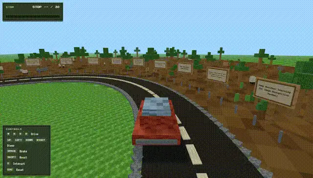

# Paperloop

A Minecraft-themed driving world to explore and open landmark AI papers. \
Live app: [https://mypaperloop.vercel.app](https://mypaperloop.vercel.app)

## Demo Video

[](./docs/media/screen-capture.mp4)

## Local Setup

```bash
npm install
npm run dev
```

Build and preview the production build:

```bash
npm run build
npm run preview
```

Run unit tests:

```bash
npm run test
```

Watch mode:

```bash
npm run test:watch
```

Optional UI runner:

```bash
npm run test:ui
```

Run end-to-end tests (Playwright):

```bash
npx playwright install
npm run test:e2e
```

## Controls

- **WASD / Arrow keys**: Drive + steer
- **Space**: Brake
- **Shift**: Boost
- **E**: Interact (when near a stop)
- **Esc**: Unfocus controls / close viewer
- **`~` (backquote)**: Toggle diagnostics panel (dev/test builds)

## Notes
Some resources block embedding with CSP / X-Frame-Options. If the in-app viewer can't load a page, a fallback message appears and the **Open in new tab** button still works.
The app validates the reading list on startup. If data is missing or invalid (for example only 29 papers), a warning toast appears and the HUD shows a small warning while still running the game with the valid entries.
